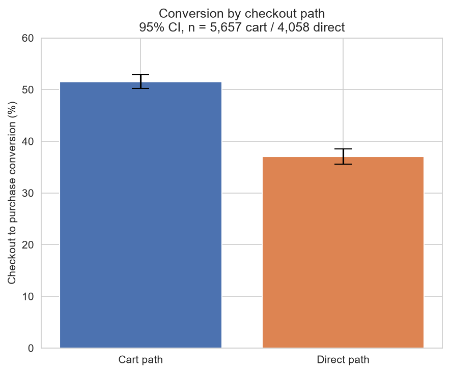
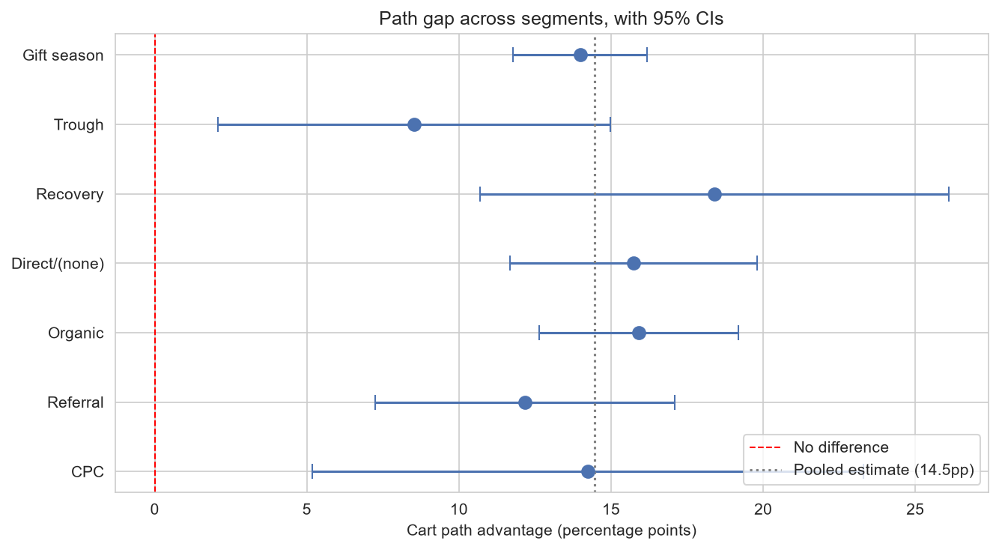

# Checkout Path Analysis — GA4 E-Commerce Funnel

**A third of buyers on this store reach checkout without ever using the cart, and they convert 14.5 percentage points worse when they do.** This project isolates that gap, tests it against every available confounder, and designs the experiment needed to establish whether the path causes it — or whether it simply reflects who chooses each path.

Dataset: [Google Analytics 4 obfuscated sample e-commerce](https://console.cloud.google.com/marketplace/product/bigquery-public-data/ga4-obfuscated-sample-ecommerce), 4.3M events from 270,154 users, November 2020 – January 2021.

---

## The question

Only 1.6% of visitors to this store buy anything. Where do they leave, which segment is responsible, and is the biggest leak fixable?

---

## Key findings

**1. The obvious funnel was wrong.** 1,504 purchasers — 34% of all buyers — reached purchase without ever firing `add_to_cart`, while every single one of the 4,419 purchasers fired `begin_checkout`. Broken tracking would scatter failures across steps; instead the later steps are 100% complete and only `add_to_cart` is missing. That indicates a second route into checkout, so `add_to_cart` was demoted from a funnel gate to a path attribute and the funnel rebuilt.

**2. Cart-path users convert 14.5pp better.** Among users who reached checkout: 51.5% of cart users purchased, against 37.1% of direct users. 95% CI [12.49, 16.44], p < 0.001, Cohen's h = 0.29 — a 39% relative difference.



**3. The gap holds everywhere it was tested.** All seven subgroups — three time periods and four traffic channels — show a significant gap in the same direction, with effect sizes clustered at 0.24–0.32 against a pooled 0.292. Every interval contains the pooled estimate, so the subgroups are consistent with a single underlying effect rather than seven separate results.



**4. Device explains nothing.** End-to-end conversion: desktop 1.60%, mobile 1.68%, tablet 1.63%. Every funnel step is within ~1pp across devices, and mobile is marginally *better* than desktop. The expected mobile-checkout problem does not exist in this data — which also rules device out as a confounder for the path gap.

**5. The cause is unresolved, and no observational analysis can resolve it.** Adding an item to a cart is itself an act of intent, so the gap may reflect *who* chooses each path rather than *how* each path is built. Supporting this: during gift season the direct path carried 47% of checkout traffic and cart-path conversion was at its lowest (50.3%); after the shipping cutoff its share halved and cart conversion rose to 59.2%. Removing the direct path would likely push low-intent users onto the cart path rather than converting them.

---

## What made this analysis non-obvious

The findings above came from checking assumptions that a standard funnel analysis would carry through unexamined.

**The funnel definition was tested, not assumed.** Rather than accepting the textbook `view → cart → checkout → purchase` sequence, every purchaser's actual step pattern was enumerated. That is what surfaced the 34% cart-bypass and forced the rebuild.

**Purchase events are not a reliable order count.** 15.9% of purchase events carry no usable transaction ID, 7.9% carry no revenue value, and among events with a real ID there is a 7.0% duplication rate. Consequence: **opportunity is sized in users, not revenue.** Any dollar figure from this data would carry a large, unquantifiable error, so none is reported.

**A null result is reported as a finding.** Device was the leading hypothesis at the outset. It was tested and found to explain nothing, and that is stated rather than quietly dropped.

**A duplicate check that did not work is left in the repo.** The first integrity check only caught events firing at the identical microsecond and missed the real duplicates, which fire seconds apart. It is kept in `sql/01_data_profiling.sql`, labelled as insufficient, alongside the check that worked.

---

## The experiment

The naive design — randomly assign users to the cart or direct path — is impossible; nobody can be forced to add an item to a cart. What *can* be randomised is an intervention that tests the most plausible mechanism: that the cart gives users a moment to review before committing.

| | |
|---|---|
| **Hypothesis** | Adding an order-review step before payment on the direct path increases checkout-to-purchase conversion |
| **Primary metric** | Checkout → purchase conversion, direct-path users |
| **Guardrail** | Median time from `begin_checkout` to `purchase` |
| **MDE** | 4pp (37.1% → 41.1%) |
| **α / power** | 0.05 / 0.80, two-sided |
| **Sample** | 2,334 per arm |
| **Duration** | 16 weeks (whole weeks — weekend traffic is consistently lower) |

**Why not the faster option.** Running on all checkout users at the same MDE takes 7 weeks. It was rejected because cart-path users already see a review page: if the true effect is 4pp among direct users and zero among cart users, the blended effect is ~1.7pp, which a test powered for 4pp would likely miss — 7 weeks spent producing an uninterpretable null. Powering the blended test for 2pp instead takes 26 weeks, longer than testing the target population directly.

Decisions for each outcome — ship, revert, or redirect effort to the top of the funnel — are fixed in advance in `notebooks/02_experiment_design.ipynb`, so no result can be rationalised after the fact.

---

## Method

| Stage | File |
|---|---|
| Event profiling, segment coverage, data integrity | `sql/01_data_profiling.sql` |
| Funnel construction, path discovery, segmentation | `sql/02_funnel_analysis.sql` |
| z-tests, confidence intervals, effect sizes, charts | `notebooks/01_statistical_tests.ipynb` |
| Power analysis and experiment design | `notebooks/02_experiment_design.ipynb` |

Both SQL files open with their purpose and close with the findings drawn from them.

---

## Limitations

- **The data is obfuscated by Google.** Absolute rates are not this store's real rates. Only relative comparisons between steps and segments are trustworthy. Google does not publish the obfuscation method.
- **`user_pseudo_id` is device-level**, so one person on a phone and a laptop counts as two users. Sessions per user is ~1.33 over 92 days, implausibly low for a real store, which reflects this.
- **~21% of `traffic_source.medium` is placeholder** (`<Other>`, `(data deleted)`) and is excluded from channel analysis. `(none)` is kept — in GA it means direct traffic, a real category.
- **Conversion is not stationary.** November 2.19%, December 2.05%, January 1.13%. Purchases fall off a cliff on 18–19 December, consistent with a Christmas shipping cutoff. The full window is used for the headline funnel because there are only 4,419 purchasers in total; period-stratified validation is run separately.
- **Tablet is 2.3% of traffic**, so its bottom-funnel rates are low-sample and reported with that caveat rather than treated as findings.
- **Two subgroups are too thin to measure precisely.** Recovery shows the largest gap (18.4pp) but on 206 users, with a CI of [10.7, 26.1]; CPC similar. These confirm the gap exists in those segments; they do not measure its size there.
- **Seven subgroup tests at α = 0.05** give ~30% chance of at least one false positive. Under a Bonferroni correction (0.0071), six of seven still pass.

---

## Tech stack

BigQuery (SQL), Python (pandas, statsmodels, matplotlib, seaborn), Jupyter.

---

## Repository

```
├── sql/
│   ├── 01_data_profiling.sql
│   └── 02_funnel_analysis.sql
├── notebooks/
│   ├── 01_statistical_tests.ipynb
│   └── 02_experiment_design.ipynb
├── outputs/
│   ├── funnel_overall.png
│   ├── funnel_checkout.png
│   ├── path_conversion.png
│   └── subgroup_gaps.png
└── requirements.txt
```
